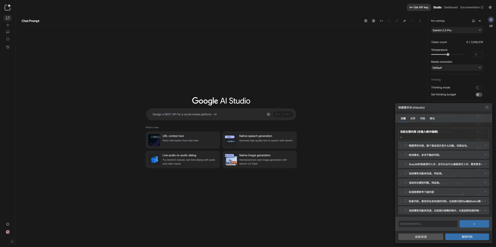

# Gemini 快捷提示词助手 (Gemini Prompt Helper)

这是一个浏览器书签脚本 (Bookmarklet)，旨在增强 Google Gemini 的使用体验。它通过在页面上注入一个可交互的面板，帮助你快速构建、管理和组合常用的提示词片段，从而极大地提升与 Gemini 交互的效率。

## 📸 预览

|        亮色模式 (Light Mode)        |       深色模式 (Dark Mode)        |
|:-------------------------------:|:-----------------------------:|
|  |  |

## ✨ 功能特性

*   **实时注入与双向同步**: 勾选/取消勾选提示词会**立即**更新 Gemini 的输入框，无需额外点击。同时，你在 Gemini 输入框中直接修改主要内容，也会被助手面板实时识别和展示。
*   **灵活的拖拽排序**: 你可以自由地拖拽排序提示词。更强大的是，代表你**主要问题**的“当前主要内容”块也可以被拖动，你可以轻松地将固定的提示词（如“输出文档”）置于主要问题之前或之后。
*   **状态持久化**: 你在面板中新增、删除或重排的提示词组合，可以通过“复制代码”功能生成一个新的书签脚本。用新代码更新你的书签，即可**永久保存你的自定义配置**。
*   **自适应主题与现代UI**: 面板会自动匹配系统的浅色/深色模式，与 Gemini 的原生界面融为一体。面板本身可以随意拖动到屏幕的任何位置。
*   **便捷的管理功能**:
    *   快速添加新的常用提示词。
    *   一键删除不需要的提示词。
    *   “全选/反选”功能，方便批量操作。
*   **安全与健壮**:
    *   代码使用了 [Trusted Types API](https://developer.mozilla.org/en-US/docs/Web/API/Trusted_Types_API)（如果浏览器支持）来防止XSS注入。
    *   所有注释都使用 `/* ... */` 格式，确保代码被压缩成一行用于书签时不会出错。

---

## 🚀 使用方式 (首次安装)

安装过程非常简单，只需创建一个特殊的书签即可。

1.  **复制脚本代码**:
    打开 `main.js` 文件，并复制其**全部**内容。

2.  **创建书签**:
    在你的浏览器（如 Chrome, Edge, Firefox）的书签栏上右键，选择“添加网页”或“添加书签”。

3.  **填写书签信息**:
    *   **名称 (Name)**: 填写一个容易记的名字，例如 `Gemini 助手` 或 `🚀`。
    *   **网址 (URL) / 地址 (Address)**: **这是最关键的一步。** 将你刚才复制的**全部代码**粘贴到这个输入框里。请确保粘贴的内容以 `javascript:` 开头。

4.  **保存并使用**:
    保存书签。现在，打开 Google Gemini 的页面 (`https://gemini.google.com/`)，然后点击你刚刚创建的那个书签。助手面板就会出现在页面右下角！

---

## 💾 如何保存你的修改 (更新书签)

当你通过面板添加了新的提示词，或者删除了、重排了现有的提示词后，这些改动只会在此次会话中生效。如果你希望永久保存这些改动，请遵循以下步骤：

1.  **完成你的自定义**: 在助手面板中，添加、删除、排序你的提示词，直到满意为止。

2.  **生成新代码**: 点击面板底部的 **`复制代码`** 按钮。这会将包含了你当前所有提示词和设置的新版脚本代码复制到你的剪贴板。

3.  **编辑旧书签**:
    *   在你浏览器书签栏上找到“Gemini 助手”书签，右键点击它，选择“修改”或“编辑”。
    *   在弹出的窗口中，清空 **网址 (URL)** 字段里的旧代码。
    *   将剪贴板里的新代码粘贴进去。

4.  **保存更改**:
    点击“保存”。现在，你的书签已经更新了！下次在 Gemini 页面点击它时，就会加载你自定义过的提示词列表和顺序。

---

## 🛠️ 技术简述

本工具的本质是一个 **书签脚本 (Bookmarklet)**，它是一段存储在书签中的 JavaScript 代码。当用户点击书签时，浏览器会在当前页面上执行这段代码。

*   **DOM 操作**: 脚本通过 JavaScript 直接在 Gemini 页面的 DOM (文档对象模型) 中创建并插入UI面板和样式。
*   **状态管理**:
    *   所有预设和用户添加的提示词都存储在脚本内部的 `prompts` 数组中。
    *   元素的显示顺序由 `itemOrder` 数组控制，这使得“主要内容”块也能参与排序。
*   **事件监听**: 脚本通过监听用户的点击、拖拽、输入等事件来响应交互，并实时更新 Gemini 的输入框内容。
*   **持久化机制**: “复制代码”功能通过 `main.toString()` 获取函数自身的源代码，然后用 `JSON.stringify()` 将当前最新的 `prompts` 数组序列化，并替换掉源代码中的旧数组，从而生成一份包含最新状态的、可直接使用的新脚本。